---
## Front matter
lang: ru-RU
title: Лабораторная работа №1
subtitle: Дисциплина - Математическое моделирование
author:
  - Пронякова О.М.
institute:
  - Российский университет дружбы народов, Москва, Россия
date: 16 февраля 2024

## i18n babel
babel-lang: russian
babel-otherlangs: english

## Formatting pdf
toc: false
toc-title: Содержание
slide_level: 2
aspectratio: 169
section-titles: true
theme: metropolis
header-includes:
 - \metroset{progressbar=frametitle,sectionpage=progressbar,numbering=fraction}
---

# Информация

## Докладчик

:::::::::::::: {.columns align=center}
::: {.column width="70%"}

  * Пронякова Ольга Максимовна
  * студент НКАбд-02-22
  * факультет физико-математических и естественных наук
  * Российский университет дружбы народов

:::
::::::::::::::

# Создание презентации

## Цель работы

Вспомнить умения работы с git

## Этапы выполнения работы

Настройка core.autocrlf с параметрами true и input делает все переводы
строк текстовых файлов в главном репозитории одинаковы.
core.autocrlf true - git автоматически конвертирует CRLF->LF при комми-
те и обратно LF->CRLF при выгрузке кода из репозитория на файловую систему
(используют в Windows). core.autocrlf input - конвертация CRLF в LF только
при коммитах (используют в Mac/Linux).
Если core.safecrlf установлен в true или warm, git проверяет, если пре-
образование является обратимым для текущей настройки core.autocrlf.
core.safecrlf true - отвержение необратимого преобразования lf<->crlf.
Полезно, когда специфические бинарники похожие на текстовые файлы.
core.safecrlf warn - печать только предупреждение, но принимает необрати-
мый переход.

## Этапы выполнения работы

В пустом рабочем каталоге создаю пустой каталога с именем
hello, затем вхожу в него и создаю там файл с именем hello.html(рис.[1]).

{ #fig:pic1 width=100% }

## Этапы выполнения работы

Создаю git репозиторий из этого каталога, добавляю файл в реаозиторий и проверяю статус(рис.[2]).

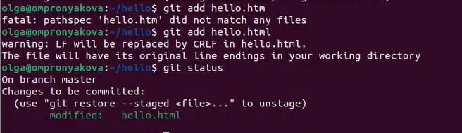{ #fig:pic2 width=100% }

## Этапы выполнения работы

Изменяю содержимое файла hello.html и проверяю состояние рабочего каталога(рис.[3]).

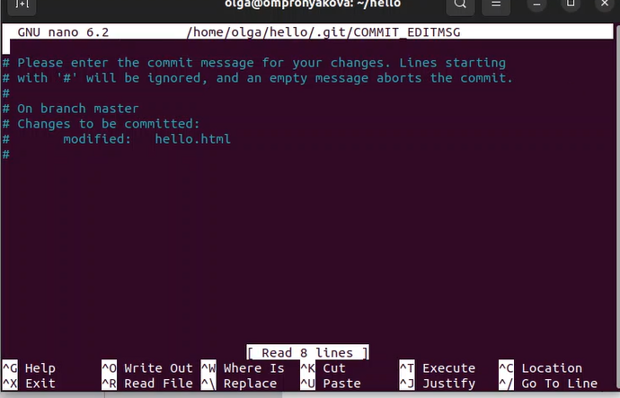{ #fig:pic3 width=100% }

## Этапы выполнения работы

Выполняю команду git, чтобы проиндексировать изменения и роверяю состояние(рис.[4]).

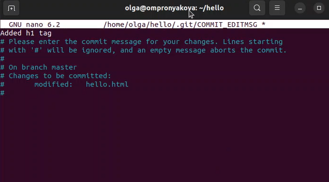{ #fig:pic4 width=100% }

## Этапы выполнения работы

Делаю коммит. проверяю состояние. Изменяю страницу «Hello, World», чтобы она содержала стандартные теги <html> и <body> и добавляю это изменение в индекс git(рис.[5]).

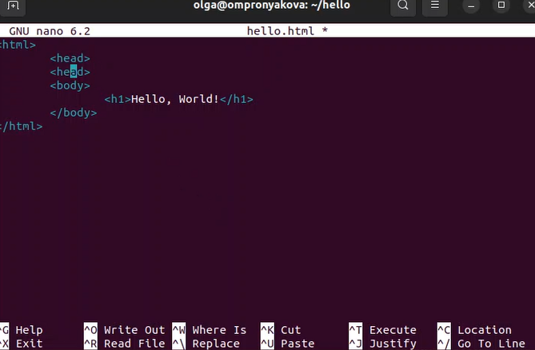{ #fig:pic5 width=100% }

## Этапы выполнения работы

произвожу коммит проиндексированного изменения (значение по умолчанию), а затем еще раз проверяю состояние(рис.[6]).

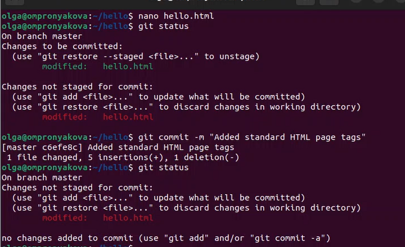{ #fig:pic6 width=100% }

## Этапы выполнения работы

Получяю список произведенных изменений(рис.[7]).

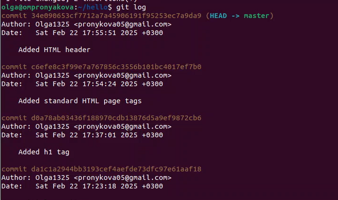{ #fig:pic7 width=100% }

## Этапы выполнения работы

Применяю несколько вариантов отображения лога(рис.[8]).

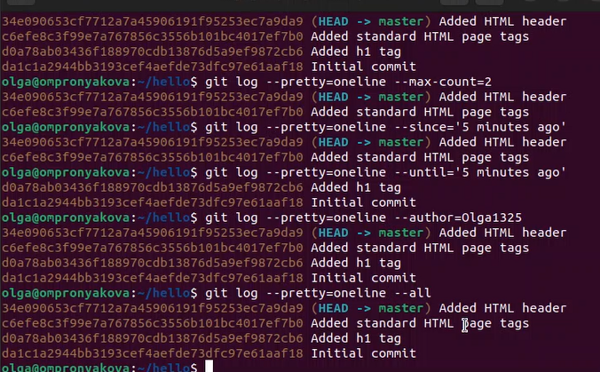{ #fig:pic8 width=100% }

## Этапы выполнения работы

Справочная страница (рис.[9]).

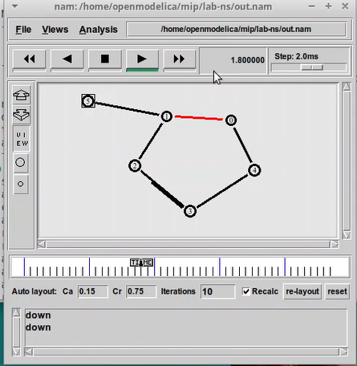{ #fig:pic9 width=100% }

## Этапы выполнения работы

Изучаю данные лога и найдите хэш для первого коммита. Он должен быть в последней строке данных. Использую этот хэш-код (достаточно первых 7 знаков) в команде ниже. Затем проверяю содержимое файла hello.html(рис.[10]).

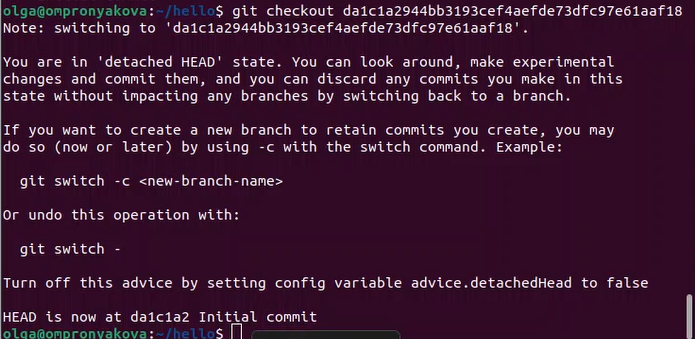{ #fig:pic10 width=100% }

## Этапы выполнения работы

Теги для предыдущих версий Давайте создадим тег для версии, которая идет
перед текущей версией и назовем его v1-beta. В первую очередь нам надо переключиться на предыдущую версию. Вместо поиска до хэш, мы будем использовать
^, обозначающее «родитель v1». Вместо обозначения v1^ можно использовать
v1~1. Это обозначение можно определить как «первую версию предшествующую v1»(рис.[11]).

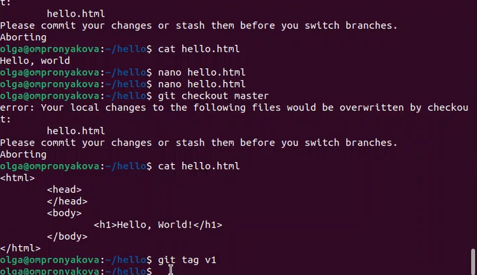{ #fig:pic11 width=100% }

## Этапы выполнения работы

делаю ее версией v1-beta и пробую попереключаться между двумя отмеченными версиями(рис.[12]).

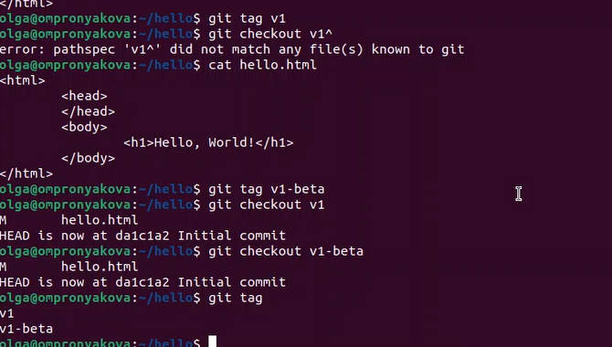{ #fig:pic12 width=100% }

## Этапы выполнения работы

Смотрю теги(рис.[13]).

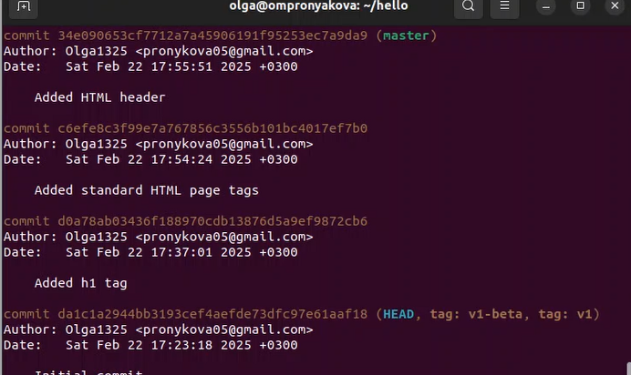{ #fig:pic13 width=100% }

## Этапы выполнения работы

Вношу изменение в файл hello.html в виде нежелательного комментария(рис.[14]).

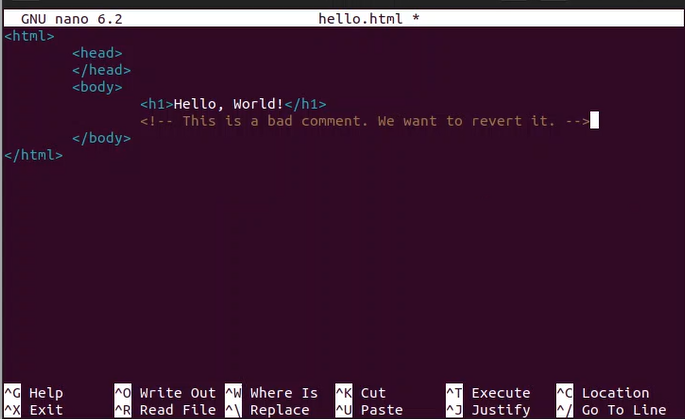{ #fig:pic14 width=100% }

## Этапы выполнения работы

Использую команду git checkout для переключения версии файла hello.html в репозитории(рис.[15]).

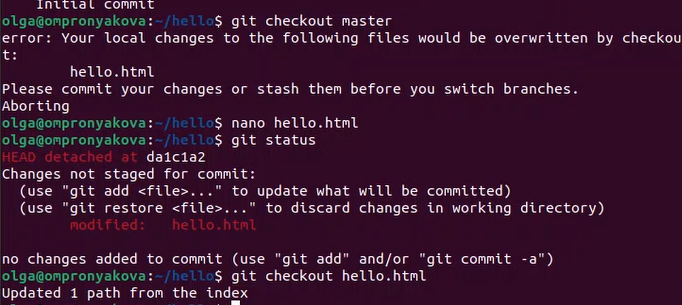{ #fig:pic15 width=100% }

## Этапы выполнения работы

Вношу изменение в файл hello.html в виде нежелательного комментария(рис.[16]).

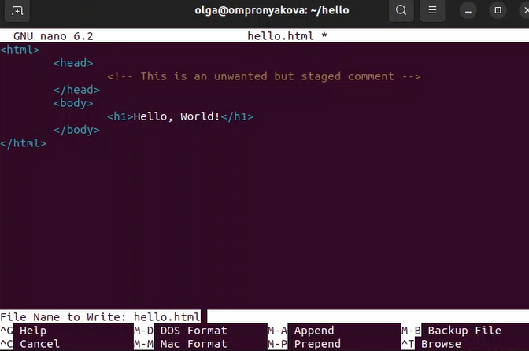{ #fig:pic16 width=100% }

## Этапы выполнения работы

Проиндексирую это изменение и проверяю состояние нежелательного изменения(рис.[17]).

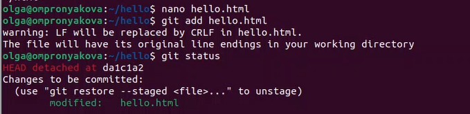{ #fig:pic17 width=100% }

## Этапы выполнения работы

делаю отмену индексации изменений и проверяю статус(рис.[18]).

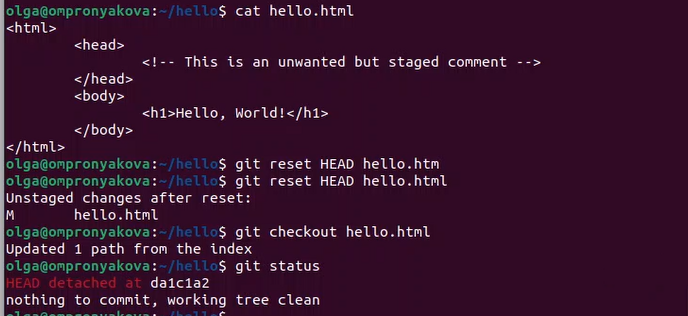{ #fig:pic18 width=100% }

## Этапы выполнения работы

Изменяю файл hello.html на следующий(рис.[19]).

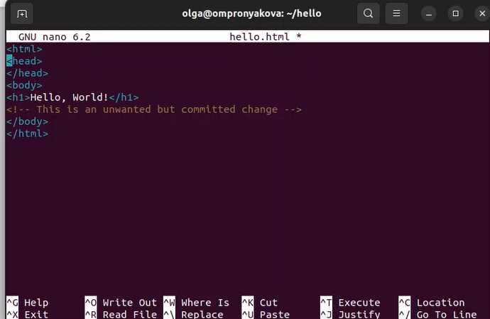{ #fig:pic19 width=100% }

## Этапы выполнения работы

Проверяю лог на нежелательные и отмененные коммиты в мой репозиторий(рис.[20]).

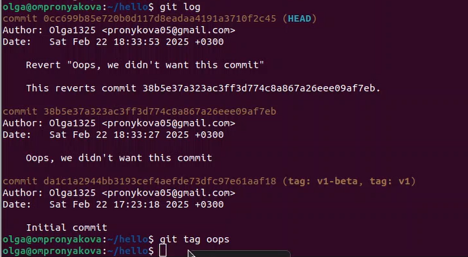{ #fig:pic20 width=100% }

## Этапы выполнения работы

Но прежде чем удалить коммиты, давайте отметим последний коммит тегом, чтобы потом можно было его найти. сбросим ветку до этой точки. Поскольку ветка имеет тег, мы можем использовать имя тега в команде сброса. Тег oops свою функцию выполнил. Удаляю его и коммиты, на которые он ссылался, сборщиком мусора(рис.[21]).

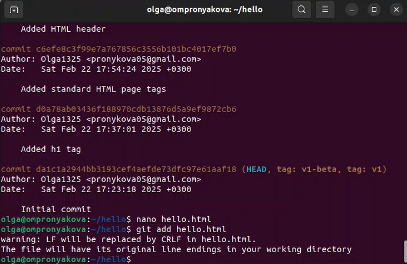{ #fig:pic21 width=100% }

## Этапы выполнения работы

Обновляю страницу hello, включив в нее email(рис.[22]).

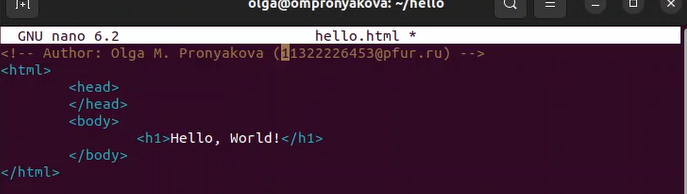{ #fig:pic22 width=100% }

## Этапы выполнения работы

Действительно не хотим создавать отдельный коммит только ради электронной почты. Давайте изменим предыдущий коммит, включив в него адрес электронной почты(рис.[23]).

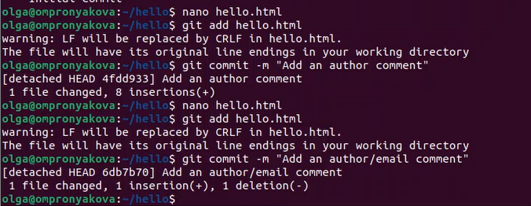{ #fig:pic23 width=100% }

## Этапы выполнения работы

Создаю структуру нашего репозитория. Давайте перенесем страницу в каталог lib(рис.[-@fig:pic24]).

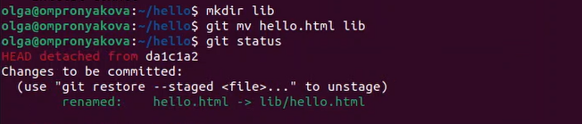{ #fig:pic24 width=100% }

## Этапы выполнения работы

Добавляю файл index.html в наш репозиторий и делаю коммит(рис.[25]).

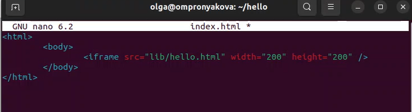{ #fig:pic25 width=100% }

## Этапы выполнения работы

Каталог, в котором хранится вся информация git. здесь набор каталогов, имена которых состоят из 2 символов. Имена каталогов являются первыми двумя буквами хэша sha1 объекта, хранящегося в
git. Смотрим в один из каталогов с именем из 2 букв. Вы увидите файлы с именами
из 38 символов. Это файлы, содержащие объекты, хранящиеся в git(рис.[26]).

## Этапы выполнения работы

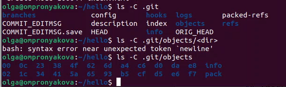{ #fig:pic26 width=100% }

## Этапы выполнения работы

Узнаю файлы в подкаталоге тегов. Каждый файл соответствует тегу, ранее созданному с помощью команды git tag. Его содержание — это всего лишь хэш коммита, привязанный к тегу.
Каталог heads практически аналогичен, но используется для веток, а не тегов.
На данный момент у нас есть только одна ветка, так что все, что вы увидите в этом
каталоге – это ветка master(рис.[27]).

## Этапы выполнения работы

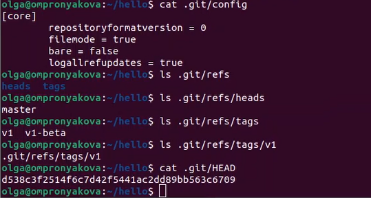{ #fig:pic27 width=100% }

## Этапы выполнения работы

Мы можем вывести дерево каталогов, ссылка на который идет в коммите. Это долж-
но быть описание файлов (верхнего уровня) в нашем проекте (для конкретного
коммита). Используйте SHA1 хэш из строки «дерева»(рис.[28]), (рис.[29]).

## Этапы выполнения работы

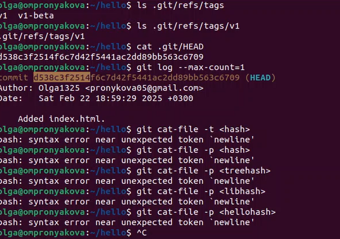{ #fig:pic28 width=100% }

## Этапы выполнения работы

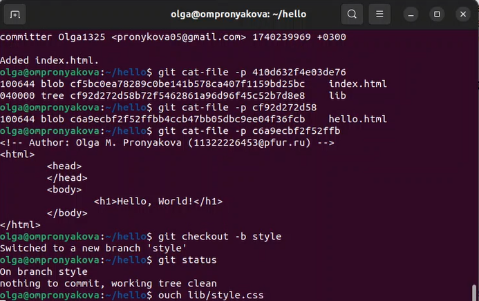{ #fig:pic29 width=100% }

## Этапы выполнения работы

создаем новую ветку «style». Добавляю файл стилей style.css(рис.[30]).

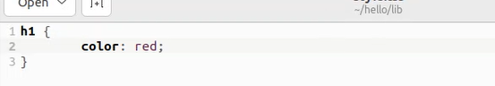{ #fig:pic30 width=100% }

## Этапы выполнения работы

Обновляю файл hello.html, чтобы использовать стили style.css(рис.[31]).

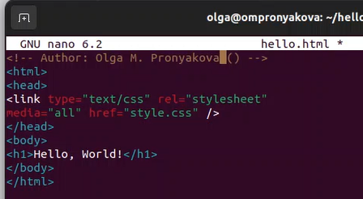{ #fig:pic31 width=100% }

## Этапы выполнения работы

Обновляю файл index.html, чтобы он тоже использовал style.css(рис.[32]).

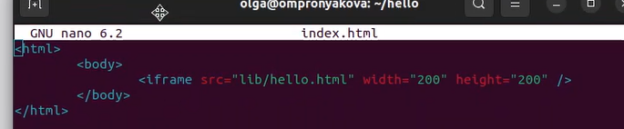{ #fig:pic32 width=100% }

## Этапы выполнения работы

Теперь у нас 2 веткирис(рис.[33]), (рис.[34]).

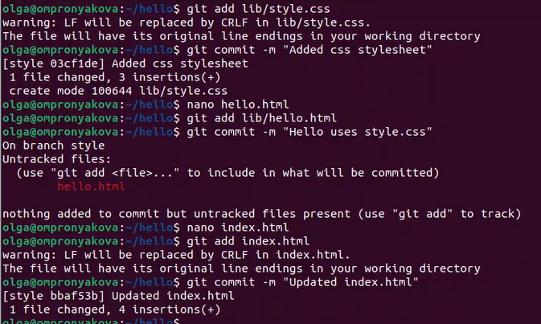{ #fig:pic33 width=100% }

## Этапы выполнения работы

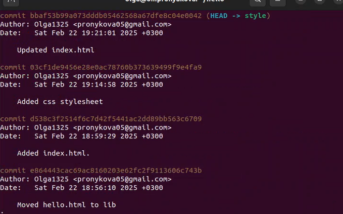{ #fig:pic34 width=100% }

## Выводы
Вспомнила умения работы с git

