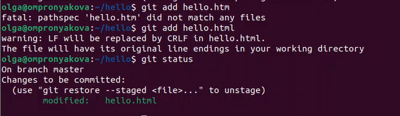
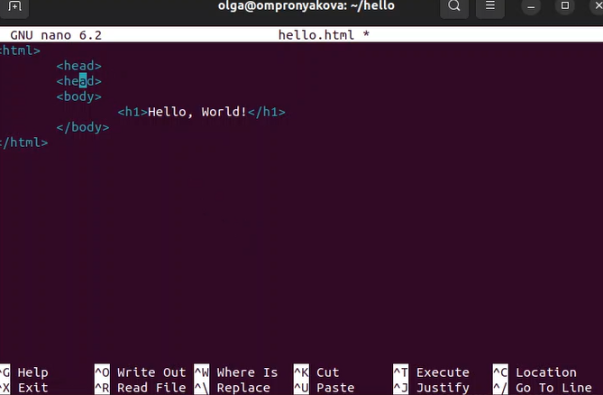
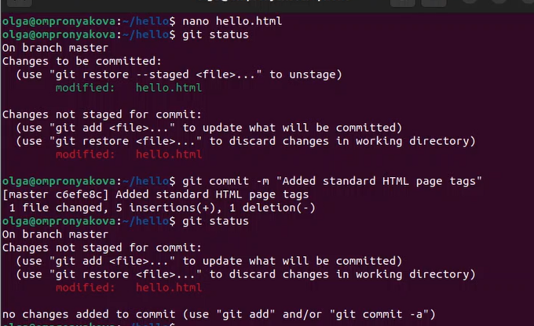

---
## Front matter
title: "Лабораторная работа №1"
subtitle: "Дисциплина: Математическое моделирование"
author: "Пронякова Ольга Максимовна"

## Generic otions
lang: ru-RU
toc-title: "Содержание"

## Bibliography
bibliography: bib/cite.bib
csl: pandoc/csl/gost-r-7-0-5-2008-numeric.csl

## Pdf output format
toc: true # Table of contents
toc-depth: 2
lof: true # List of figures
lot: true # List of tables
fontsize: 12pt
linestretch: 1.5
papersize: a4
documentclass: scrreprt
## I18n polyglossia
polyglossia-lang:
  name: russian
  options:
	- spelling=modern
	- babelshorthands=true
polyglossia-otherlangs:
  name: english
## I18n babel
babel-lang: russian
babel-otherlangs: english
## Fonts
mainfont: IBM Plex Serif
romanfont: IBM Plex Serif
sansfont: IBM Plex Sans
monofont: IBM Plex Mono
mathfont: STIX Two Math
mainfontoptions: Ligatures=Common,Ligatures=TeX,Scale=0.94
romanfontoptions: Ligatures=Common,Ligatures=TeX,Scale=0.94
sansfontoptions: Ligatures=Common,Ligatures=TeX,Scale=MatchLowercase,Scale=0.94
monofontoptions: Scale=MatchLowercase,Scale=0.94,FakeStretch=0.9
mathfontoptions:
## Biblatex
biblatex: true
biblio-style: "gost-numeric"
biblatexoptions:
  - parentracker=true
  - backend=biber
  - hyperref=auto
  - language=auto
  - autolang=other*
  - citestyle=gost-numeric
## Pandoc-crossref LaTeX customization
figureTitle: "Рис."
tableTitle: "Таблица"
listingTitle: "Листинг"
lofTitle: "Список иллюстраций"
lotTitle: "Список таблиц"
lolTitle: "Листинги"
## Misc options
indent: true
header-includes:
  - \usepackage{indentfirst}
  - \usepackage{float} # keep figures where there are in the text
  - \floatplacement{figure}{H} # keep figures where there are in the text
---

# Цель работы

Вспомнить умения работы с git

# Выполнение лабораторной работы

Настройка core.autocrlf с параметрами true и input делает все переводы
строк текстовых файлов в главном репозитории одинаковы.
core.autocrlf true - git автоматически конвертирует CRLF->LF при комми-
те и обратно LF->CRLF при выгрузке кода из репозитория на файловую систему
(используют в Windows). core.autocrlf input - конвертация CRLF в LF только
при коммитах (используют в Mac/Linux).
Если core.safecrlf установлен в true или warm, git проверяет, если пре-
образование является обратимым для текущей настройки core.autocrlf.
core.safecrlf true - отвержение необратимого преобразования lf<->crlf.
Полезно, когда специфические бинарники похожие на текстовые файлы.
core.safecrlf warn - печать только предупреждение, но принимает необрати-
мый переход.

В пустом рабочем каталоге создаю пустой каталога с именем
hello, затем вхожу в него и создаю там файл с именем hello.html(рис.[-@fig:pic1]).

{ #fig:pic1 width=100% }

Создаю git репозиторий из этого каталога, добавляю файл в реаозиторий и проверяю статус(рис.[-@fig:pic2]).

{ #fig:pic2 width=100% }

Изменяю содержимое файла hello.html и проверяю состояние рабочего каталога(рис.[-@fig:pic3]).

{ #fig:pic3 width=100% }

Выполняю команду git, чтобы проиндексировать изменения и роверяю состояние(рис.[-@fig:pic4]).

{ #fig:pic4 width=100% }

Делаю коммит. проверяю состояние. Изменяю страницу «Hello, World», чтобы она содержала стандартные теги <html> и <body> и добавляю это изменение в индекс git(рис.[-@fig:pic5]).

{ #fig:pic5 width=100% }

произвожу коммит проиндексированного изменения (значение по умолчанию), а затем еще раз проверяю состояние(рис.[-@fig:pic6]).

{ #fig:pic6 width=100% }

Получяю список произведенных изменений(рис.[-@fig:pic7]).

{ #fig:pic7 width=100% }

Применяю несколько вариантов отображения лога(рис.[-@fig:pic8]).

{ #fig:pic8 width=100% }

Справочная страница (рис.[-@fig:pic9]).

{ #fig:pic9 width=100% }

Изучаю данные лога и найдите хэш для первого коммита. Он должен быть в последней строке данных. Использую этот хэш-код (достаточно первых 7 знаков) в команде ниже. Затем проверяю содержимое файла hello.html(рис.[-@fig:pic10]).

{ #fig:pic10 width=100% }

Теги для предыдущих версий Давайте создадим тег для версии, которая идет
перед текущей версией и назовем его v1-beta. В первую очередь нам надо переключиться на предыдущую версию. Вместо поиска до хэш, мы будем использовать
^, обозначающее «родитель v1». Вместо обозначения v1^ можно использовать
v1~1. Это обозначение можно определить как «первую версию предшествующую v1»(рис.[-@fig:pic11]).

{ #fig:pic11 width=100% }

делаю ее версией v1-beta и пробую попереключаться между двумя отмеченными версиями(рис.[-@fig:pic12]).

{ #fig:pic12 width=100% }

Смотрю теги(рис.[-@fig:pic13]).

{ #fig:pic13 width=100% }

Вношу изменение в файл hello.html в виде нежелательного комментария(рис.[-@fig:pic14]).

{ #fig:pic14 width=100% }

Использую команду git checkout для переключения версии файла hello.html в репозитории(рис.[-@fig:pic15]).

{ #fig:pic15 width=100% }

Вношу изменение в файл hello.html в виде нежелательного комментария(рис.[-@fig:pic16]).

{ #fig:pic16 width=100% }

Проиндексирую это изменение и проверяю состояние нежелательного изменения(рис.[-@fig:pic17]).

{ #fig:pic17 width=100% }

делаю отмену индексации изменений и проверяю статус(рис.[-@fig:pic18]).

{ #fig:pic18 width=100% }

Изменяю файл hello.html на следующий(рис.[-@fig:pic19]).

{ #fig:pic19 width=100% }

Проверяю лог на нежелательные и отмененные коммиты в мой репозиторий(рис.[-@fig:pic20]).

{ #fig:pic20 width=100% }

Но прежде чем удалить коммиты, давайте отметим последний коммит тегом, чтобы потом можно было его найти. сбросим ветку до этой точки. Поскольку ветка имеет тег, мы можем использовать имя тега в команде сброса. Тег oops свою функцию выполнил. Удаляю его и коммиты, на которые он ссылался, сборщиком мусора(рис.[-@fig:pic21]).

{ #fig:pic21 width=100% }

Обновляю страницу hello, включив в нее email(рис.[-@fig:pic22]).

{ #fig:pic22 width=100% }

Действительно не хотим создавать отдельный коммит только ради электронной почты. Давайте изменим предыдущий коммит, включив в него адрес электронной почты(рис.[-@fig:pic23]).

{ #fig:pic23 width=100% }

Создаю структуру нашего репозитория. Давайте перенесем страницу в каталог lib(рис.[-@fig:pic24]).

{ #fig:pic24 width=100% }

Добавляю файл index.html в наш репозиторий и делаю коммит(рис.[-@fig:pic25]).

{ #fig:pic25 width=100% }

Каталог, в котором хранится вся информация git. здесь набор каталогов, имена которых состоят из 2 символов. Имена каталогов являются первыми двумя буквами хэша sha1 объекта, хранящегося в
git. Смотрим в один из каталогов с именем из 2 букв. Вы увидите файлы с именами
из 38 символов. Это файлы, содержащие объекты, хранящиеся в git(рис.[-@fig:pic26]).

{ #fig:pic26 width=100% }

Узнаю файлы в подкаталоге тегов. Каждый файл соответствует тегу, ранее созданному с помощью команды git tag. Его содержание — это всего лишь хэш коммита, привязанный к тегу.
Каталог heads практически аналогичен, но используется для веток, а не тегов.
На данный момент у нас есть только одна ветка, так что все, что вы увидите в этом
каталоге – это ветка master(рис.[-@fig:pic27]).

{ #fig:pic27 width=100% }

Мы можем вывести дерево каталогов, ссылка на который идет в коммите. Это долж-
но быть описание файлов (верхнего уровня) в нашем проекте (для конкретного
коммита). Используйте SHA1 хэш из строки «дерева»(рис.[-@fig:pic28]), (рис.[-@fig:pic29]).

{ #fig:pic28 width=100% }

{ #fig:pic29 width=100% }

создаем новую ветку «style». Добавляю файл стилей style.css(рис.[-@fig:pic30]).

{ #fig:pic30 width=100% }

Обновляю файл hello.html, чтобы использовать стили style.css(рис.[-@fig:pic31]).

{ #fig:pic31 width=100% }

Обновляю файл index.html, чтобы он тоже использовал style.css(рис.[-@fig:pic32]).

{ #fig:pic32 width=100% }

Теперь у нас 2 веткирис(рис.[-@fig:pic33]), (рис.[-@fig:pic34]).

{ #fig:pic33 width=100% }

{ #fig:pic34 width=100% }

# Выводы

Вспомнила умения работы с git

# Список литературы{.unnumbered}

::: {#refs}
:::
