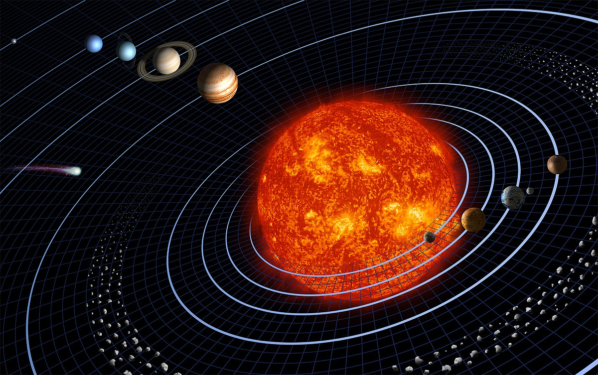

---
## Front matter
title: "Доклад на тему: Образование планетных систем"
subtitle: "Дисциплина: Математическое моделирование"
author: "Оширова Ю.Н., Пронякова О.М., Сидорова Н.А., Тимофеева Е.Н."

## Generic otions
lang: ru-RU
toc-title: "Содержание"

## Bibliography
bibliography: bib/cite.bib
csl: pandoc/csl/gost-r-7-0-5-2008-numeric.csl

## Pdf output format
toc: true # Table of contents
toc-depth: 2
lof: true # List of figures
lot: true # List of tables
fontsize: 12pt
linestretch: 1.5
papersize: a4
documentclass: scrreprt
## I18n polyglossia
polyglossia-lang:
  name: russian
  options:
	- spelling=modern
	- babelshorthands=true
polyglossia-otherlangs:
  name: english
## I18n babel
babel-lang: russian
babel-otherlangs: english
## Fonts
mainfont: IBM Plex Serif
romanfont: IBM Plex Serif
sansfont: IBM Plex Sans
monofont: IBM Plex Mono
mathfont: STIX Two Math
mainfontoptions: Ligatures=Common,Ligatures=TeX,Scale=0.94
romanfontoptions: Ligatures=Common,Ligatures=TeX,Scale=0.94
sansfontoptions: Ligatures=Common,Ligatures=TeX,Scale=MatchLowercase,Scale=0.94
monofontoptions: Scale=MatchLowercase,Scale=0.94,FakeStretch=0.9
mathfontoptions:
## Biblatex
biblatex: true
biblio-style: "gost-numeric"
biblatexoptions:
  - parentracker=true
  - backend=biber
  - hyperref=auto
  - language=auto
  - autolang=other*
  - citestyle=gost-numeric
## Pandoc-crossref LaTeX customization
figureTitle: "Рис."
tableTitle: "Таблица"
listingTitle: "Листинг"
lofTitle: "Список иллюстраций"
lotTitle: "Список таблиц"
lolTitle: "Листинги"
## Misc options
indent: true
header-includes:
  - \usepackage{indentfirst}
  - \usepackage{float} # keep figures where there are in the text
  - \floatplacement{figure}{H} # keep figures where there are in the text
---

# Образование планетных систем: научная проблема, теоретическое описание и модель

## Введение

Образование планетных систем является одной из ключевых задач астрофизики, связанной с процессами формирования звезд, эволюцией газопылевых дисков и гравитационными взаимодействиями в протопланетных облаках. Современные модели пытаются объяснить механизм, который привел к формированию планет вокруг звезд, включая нашу Солнечную систему. Исследования в данной области помогают не только понять происхождение Земли и других планет, но и выявить закономерности формирования экзопланетных систем во Вселенной(рис.[-@fig:pic1]).

{ #fig:pic1 width=100% }

## Научная проблема 

Главной научной проблемой является объяснение механизма формирования планетных систем из газопылевых дисков вокруг молодых звезд. Вопросы, которые необходимо решить:
- Как происходит начальная стадия формирования протопланетных дисков?
- Какие силы влияют на формирование планетезималей и их последующую эволюцию?
- Как гравитационные взаимодействия влияют на динамику системы?
- Каковы условия для образования устойчивых орбит и распределения вещества в системе?
- Почему некоторые планетные системы значительно отличаются от нашей?

Эти вопросы требуют комплексного подхода, включающего наблюдательные данные, компьютерное моделирование и теоретические расчёты.

## Теоретическое описание задачи

Согласно современным представлениям, процесс образования планетных систем начинается с формирования газопылевого диска вокруг молодой звезды. Основные стадии этого процесса включают:

1. Формирование протопланетного диска: В результате коллапса газового облака под действием гравитации возникает вращающийся диск из газа и пыли.
2. Аккреция частиц: Мелкие частицы сталкиваются и слипаются, образуя всё более крупные объекты — планетезимали (тела размером от километров до сотен километров).
3. Формирование протопланет: Гравитационные взаимодействия приводят к объединению планетезималей в более массивные тела.
4. Очищение диска: Планеты продолжают наращивать массу, а гравитационное воздействие звезды и планет очищает окружающее пространство от остатков газа и пыли.

Важную роль в этом процессе играют гравитационные силы, газодинамика, электромагнитные взаимодействия и столкновения частиц.

## Математическая модель

Для описания динамики частиц в газопылевом диске используются уравнения гравитационного взаимодействия и механики сплошных сред.

### Гравитационная потенциальная энергия системы

Гравитационное взаимодействие частиц описывается формулой(рис.[-@fig:pic2]).

{ #fig:pic2 width=100% }

Эта энергия играет ключевую роль в определении устойчивости системы, так как высокая потенциальная энергия способствует активным гравитационным взаимодействиям между частицами.

### Динамика вращающегося диска

Распределение частиц в газопылевом диске можно описать через случайное распределение радиус-векторов(рис.[-@fig:pic3]):

{ #fig:pic3 width=100% }

Начальные скорости частиц определяются из третьего закона Кеплера(рис.[-@fig:pic4]):

{ #fig:pic4 width=100% }

Для учета газового сопротивления в плотной среде используется формула(рис.[-@fig:pic5]):

{ #fig:pic5 width=100% }

где \(k\) — коэффициент сопротивления, зависящий от плотности газа. Это сопротивление замедляет движение частиц и способствует их сближению и слиянию.

### Модель слияния частиц

При столкновении частиц их слияние можно описать через закон сохранения импульса(рис.[-@fig:pic6]):

{ #fig:pic6 width=100% }

Эта модель предполагает идеально неупругое столкновение, при котором две частицы объединяются в одну. Эффективность слияния определяется критерием скорости(рис.[-@fig:pic7]):

{ #fig:pic7 width=100% }

где \(v_{кр}\) — критическая скорость, при которой слияние возможно. Если скорость превышает \(v_{кр}\), частицы разрушаются или рассеиваются.

Дополнительные силы, такие как электростатические и магнитные взаимодействия, могут влиять на процесс слияния, особенно на ранних стадиях формирования планетезималей.

## Заключение

Современные методы исследования формирования планетных систем включают численные симуляции, наблюдения экзопланетных систем и лабораторные эксперименты. Моделирование позволяет выявить закономерности в распределении планет и их динамическом эволюционном пути. В дальнейшем исследования в этой области помогут уточнить модели формирования нашей Солнечной системы и выявить возможные сценарии образования экзопланетных систем во Вселенной(рис.[-@fig:pic8]).

{ #fig:pic8 width=100% }

## Интересные факты

- Система TRAPPIST-1 содержит семь экзопланет, три из которых находятся в зоне обитаемости(рис.[-@fig:pic9]).

{ #fig:pic9 width=100% }

- Газовые гиганты могут мигрировать ближе к своим звездам, что объясняет наличие "горячих юпитеров(рис.[-@fig:pic10]).

{ #fig:pic10 width=100% }

- По данным телескопа Kepler, во Вселенной может существовать более 100 миллиардов экзопланет(рис.[-@fig:pic11]).

{ #fig:pic11 width=100% }

- Планетные системы с несколькими звездами (например, Альфа Центавра) могут обладать сложной динамикой формирования(рис.[-@fig:pic12]).

{ #fig:pic12 width=100% }

- Луна Земли могла образоваться в результате гигантского столкновения с протопланетой Тейя(рис.[-@fig:pic13]).

{ #fig:pic13 width=100% }
