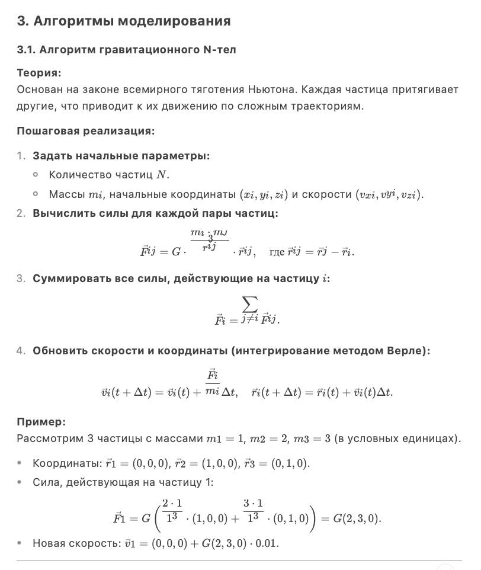
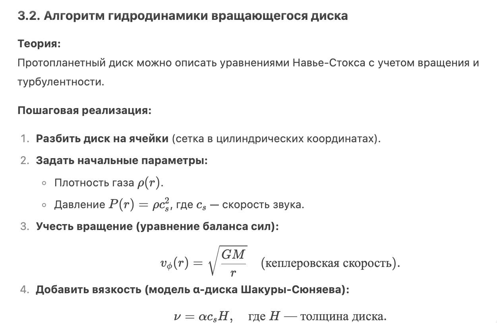
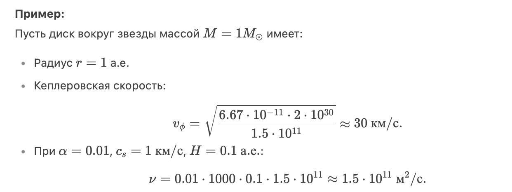
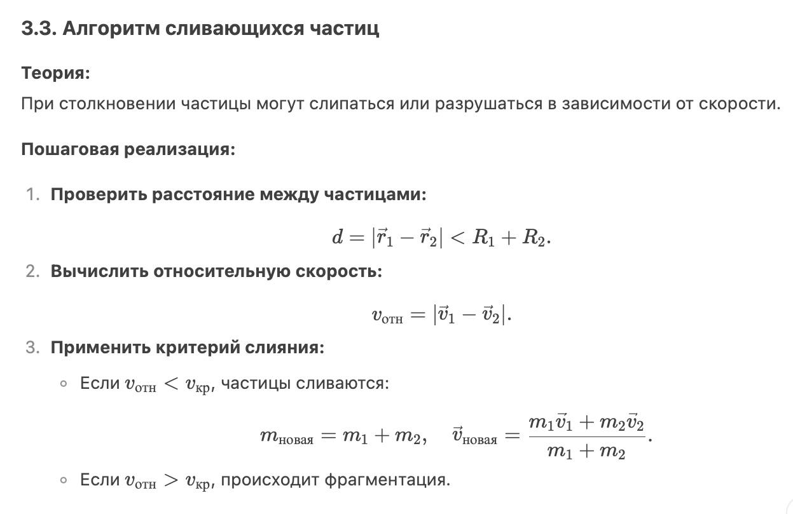
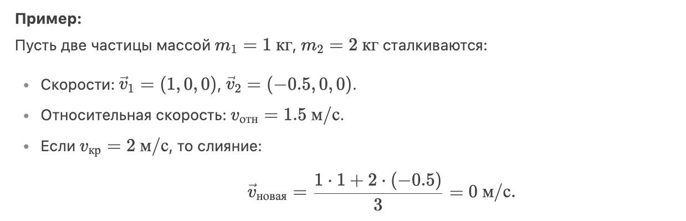

---
## Front matter
title: "Доклад на тему: Образование планетных систем"
subtitle: "Дисциплина: Математическое моделирование"
author: "Оширова Ю.Н., Пронякова О.М., Сидорова Н.А., Тимофеева Е.Н."

## Generic otions
lang: ru-RU
toc-title: "Содержание"

## Bibliography
bibliography: bib/cite.bib
csl: pandoc/csl/gost-r-7-0-5-2008-numeric.csl

## Pdf output format
toc: true # Table of contents
toc-depth: 2
lof: true # List of figures
lot: true # List of tables
fontsize: 12pt
linestretch: 1.5
papersize: a4
documentclass: scrreprt
## I18n polyglossia
polyglossia-lang:
  name: russian
  options:
	- spelling=modern
	- babelshorthands=true
polyglossia-otherlangs:
  name: english
## I18n babel
babel-lang: russian
babel-otherlangs: english
## Fonts
mainfont: IBM Plex Serif
romanfont: IBM Plex Serif
sansfont: IBM Plex Sans
monofont: IBM Plex Mono
mathfont: STIX Two Math
mainfontoptions: Ligatures=Common,Ligatures=TeX,Scale=0.94
romanfontoptions: Ligatures=Common,Ligatures=TeX,Scale=0.94
sansfontoptions: Ligatures=Common,Ligatures=TeX,Scale=MatchLowercase,Scale=0.94
monofontoptions: Scale=MatchLowercase,Scale=0.94,FakeStretch=0.9
mathfontoptions:
## Biblatex
biblatex: true
biblio-style: "gost-numeric"
biblatexoptions:
  - parentracker=true
  - backend=biber
  - hyperref=auto
  - language=auto
  - autolang=other*
  - citestyle=gost-numeric
## Pandoc-crossref LaTeX customization
figureTitle: "Рис."
tableTitle: "Таблица"
listingTitle: "Листинг"
lofTitle: "Список иллюстраций"
lotTitle: "Список таблиц"
lolTitle: "Листинги"
## Misc options
indent: true
header-includes:
  - \usepackage{indentfirst}
  - \usepackage{float} # keep figures where there are in the text
  - \floatplacement{figure}{H} # keep figures where there are in the text
---

# Образование планетных систем: научная проблема, теоретическое описание и модель

## 1. Введение  
Образование планетных систем — сложный процесс, включающий гравитационную динамику, газовую аккрецию и столкновения частиц. Для его изучения применяются численные алгоритмы, позволяющие симулировать эволюцию протопланетных дисков. В этом докладе подробно разбираются три ключевых алгоритма, их математическая основа и примеры расчетов.  

---

## 2. Постановка задачи  
Необходимо смоделировать:  
1. Гравитационное взаимодействие между частицами пыли и газа.  
2. Динамику вращающегося диска (распределение вещества, влияние турбулентности).  
3. Процесс слипания частиц с учетом критических скоростей и разрушений.  

---

## 3. Алгоритмы моделирования  

### 3.1. Алгоритм гравитационного N-тел  

{ #fig:pic1 width=100% }

### 3.2. Алгоритм гидродинамики вращающегося диска  

{ #fig:pic2 width=100% }

{ #fig:pic3 width=100% }

### 3.3. Алгоритм сливающихся частиц  

{ #fig:pic4 width=100% }

{ #fig:pic5 width=100% }

## 4. Выводы  
1. N-тел алгоритм позволяет моделировать гравитационную динамику, но требует больших вычислительных ресурсов.  
2. Гидродинамический подход эффективен для газовых дисков, но сложен в реализации.  
3. Алгоритм слияния критически важен для моделирования роста планетезималей.  

---
Заключение:  
Численные алгоритмы позволяют воспроизвести ключевые этапы формирования планет, что помогает понять происхождение Солнечной системы и экзопланет.
