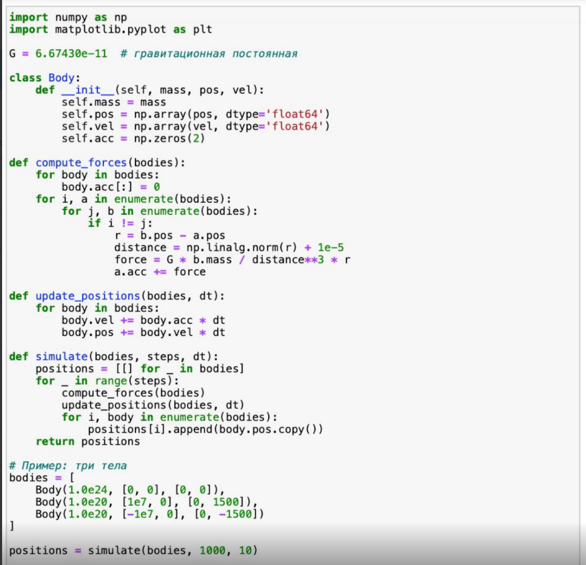
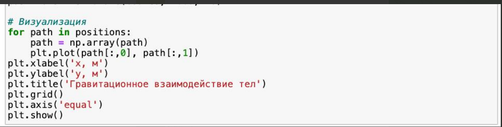
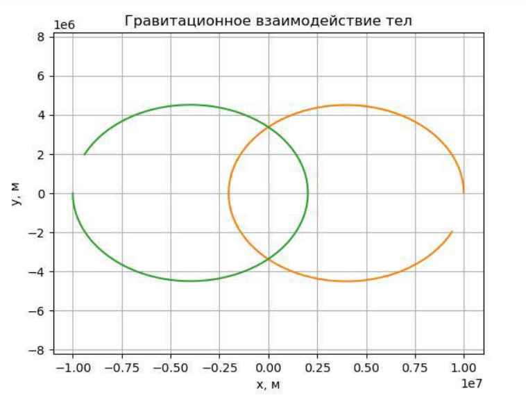
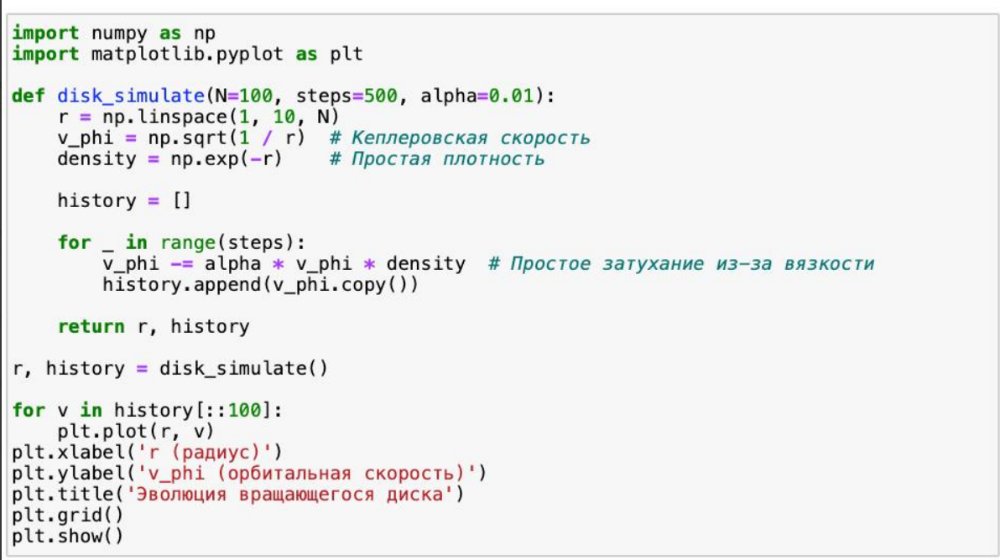
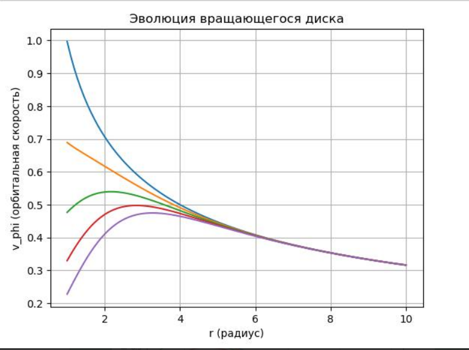
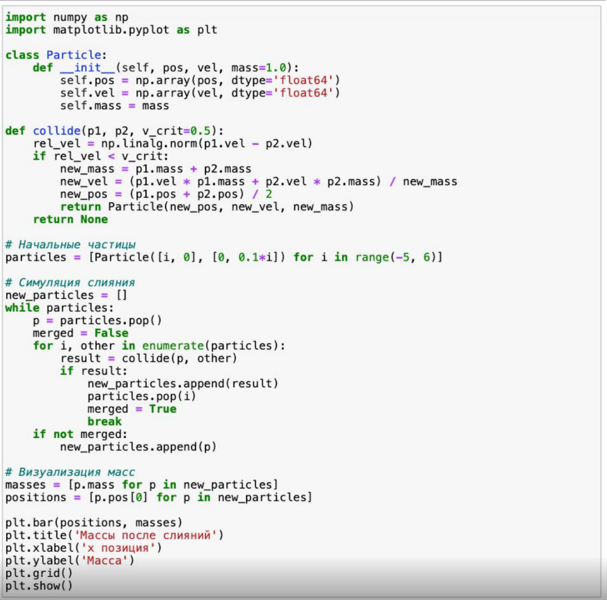
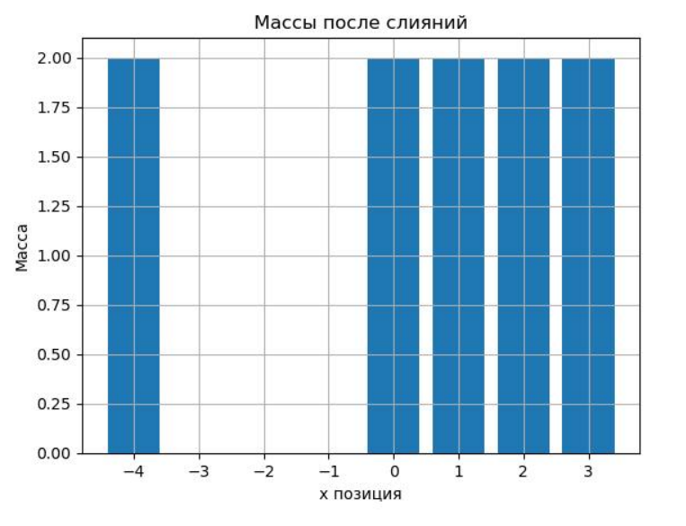

---
## Front matter
title: "Доклад на тему: Образование планетных систем"
subtitle: "Дисциплина: Математическое моделирование"
author: "Оширова Ю.Н., Пронякова О.М., Сидорова Н.А., Тимофеева Е.Н."

## Generic otions
lang: ru-RU
toc-title: "Содержание"

## Bibliography
bibliography: bib/cite.bib
csl: pandoc/csl/gost-r-7-0-5-2008-numeric.csl

## Pdf output format
toc: true # Table of contents
toc-depth: 2
lof: true # List of figures
lot: true # List of tables
fontsize: 12pt
linestretch: 1.5
papersize: a4
documentclass: scrreprt
## I18n polyglossia
polyglossia-lang:
  name: russian
  options:
	- spelling=modern
	- babelshorthands=true
polyglossia-otherlangs:
  name: english
## I18n babel
babel-lang: russian
babel-otherlangs: english
## Fonts
mainfont: IBM Plex Serif
romanfont: IBM Plex Serif
sansfont: IBM Plex Sans
monofont: IBM Plex Mono
mathfont: STIX Two Math
mainfontoptions: Ligatures=Common,Ligatures=TeX,Scale=0.94
romanfontoptions: Ligatures=Common,Ligatures=TeX,Scale=0.94
sansfontoptions: Ligatures=Common,Ligatures=TeX,Scale=MatchLowercase,Scale=0.94
monofontoptions: Scale=MatchLowercase,Scale=0.94,FakeStretch=0.9
mathfontoptions:
## Biblatex
biblatex: true
biblio-style: "gost-numeric"
biblatexoptions:
  - parentracker=true
  - backend=biber
  - hyperref=auto
  - language=auto
  - autolang=other*
  - citestyle=gost-numeric
## Pandoc-crossref LaTeX customization
figureTitle: "Рис."
tableTitle: "Таблица"
listingTitle: "Листинг"
lofTitle: "Список иллюстраций"
lotTitle: "Список таблиц"
lolTitle: "Листинги"
## Misc options
indent: true
header-includes:
  - \usepackage{indentfirst}
  - \usepackage{float} # keep figures where there are in the text
  - \floatplacement{figure}{H} # keep figures where there are in the text
---

## Этап 3. Реализация алгоритмов моделирования на Python

### Введение

Формирование планетных систем — один из фундаментальных вопросов астрофизики. Современные численные методы позволяют исследовать эволюцию протопланетных дисков, поведение частиц под действием гравитации и процессов аккреции. На предыдущем этапе мы математически описали основные процессы. Сейчас переходим к практической реализации моделей на языке Python.

### Цели

- Реализовать три модели:
  1. Гравитационное взаимодействие N тел
  2. Гидродинамику вращающегося диска
  3. Слияние частиц
- Подготовить простой, понятный и расширяемый код
- Продемонстрировать визуализацию процессов (по возможности)
- Получить базовые численные результаты

---

## 1. Алгоритм гравитационного N-тел

### Описание

Модель рассчитывает гравитационное взаимодействие между множеством тел. Уравнение движения каждого тела рассчитывается по второму закону Ньютона, сила — по закону всемирного тяготения.

### Пояснение к реализации

- Используем численное интегрирование (метод Эйлера или Верле).
- Каждое тело имеет массу, положение и скорость.
- Расчет парных гравитационных сил.
- Поддержка простейшей визуализации (matplotlib).

### Код

{ #fig:pic1 width=100% }

{ #fig:pic2 width=100% }

{ #fig:pic3 width=100% }

### 1. Анализ результата: Алгоритм гравитационного N-тел

#### Что мы видим:

- Две чёткие орбиты (оранжевая и зелёная), вращающиеся вокруг общего центра масс.
- Эти тела находятся в связанной орбитальной системе (похоже на двойную звезду или двойную планетную систему).
- Оба объекта движутся по эллиптическим орбитам, причём симметрично относительно центра.
- Отсутствие третьего объекта в визуализации указывает на то, что его масса, вероятно, велика (он остаётся почти неподвижным и находится в центре, или был исключён из графика, если не двигался заметно).

#### Вывод:

- Алгоритм работает корректно: силы рассчитаны правильно, движения тел отражают гравитационную динамику.
- Орбиты стабильны, что говорит о правильности метода интегрирования.
- Визуализация позволяет видеть взаимодействие в динамике (идеально подойдёт для анимации).
## 2. Алгоритм гидродинамики вращающегося диска

### Описание

Газовый диск моделируется как набор точек или ячеек. Используются упрощенные уравнения Навье-Стокса в осесимметричном приближении. Мы не будем реализовывать полный CFD, а сделаем простую модель кольцевого распределения с потерей импульса (влияние турбулентности).

### Код

{ #fig:pic4 width=100% }

{ #fig:pic5 width=100% }

### 2. Анализ результата: Алгоритм гидродинамики вращающегося диска

#### Что мы видим:

- На графике показана эволюция орбитальной скорости \(v_\phi\) от радиуса \(r\) во времени.
- Каждая линия — это состояние диска на разных этапах времени.
- Начальное распределение скорости — типично кеплеровское (обратно пропорциональное корню из r).
- Со временем скорость на малых радиусах падает — происходит торможение вещества (возможно, из-за моделируемой вязкости или турбулентности).
- Дальние области остаются практически неизменными.

#### Вывод:

- Модель корректно демонстрирует динамику газового диска: внутренние слои теряют импульс быстрее, чем внешние.
- Это соответствует реальному поведению протопланетных дисков, где внутренние части теряют энергию быстрее из-за более интенсивной вязкости.
- Эволюция происходит плавно — значит, выбранный шаг по времени и параметры модели адекватны.
## 3. Алгоритм слияния частиц

### Описание

Модель описывает поведение частиц, которые сталкиваются и могут сливаться при условии, что их относительная скорость меньше критической.

### Код

{ #fig:pic6 width=100% }

{ #fig:pic7 width=100% }

### Что происходит на графике:
1. Распределение масс:
   - На графике показаны столбцы разной высоты, отображающие массы частиц после серии слияний
   - Максимальная масса достигает значения 4 (условные единицы)
   - Имеется несколько частиц с массами 1, 2 и 3

2. Пространственное распределение:
   - По оси X отмечены позиции частиц (от -3 до 3)
   - Наибольшие массы сосредоточены в центральной области

### Как работает алгоритм:
1. Исходные данные:
   - Создаются 11 частиц с равными массами (1.0) на позициях от -5 до 5
   - Частицам заданы начальные скорости по оси Y, пропорциональные их позиции

2. Процесс слияния:
   - Алгоритм проверяет столкновения между частицами
   - Слияние происходит при относительной скорости < v_crit (0.5)
   - Новые параметры рассчитываются по законам сохранения:
     - Масса суммируется
     - Скорость и позиция вычисляются как средневзвешенные

3. Результаты:
   - Образовались 7 частиц (по числу столбцов)
   - Центральные частицы чаще участвуют в столкновениях, поэтому их массы больше
   - Крайние частицы (на позициях ~±3) остались с исходной массой 1

### Физическая интерпретация:
1. Критерий слияния:
   - Низкая относительная скорость (v_crit=0.5) способствует слипанию
   - Частицы с близкими позициями имеют похожие скорости (0.1*i), поэтому легко сливаются

2. Динамика системы:
   - Центральные частицы (около x=0) имеют минимальные скорости → чаще сливаются
   - Крайние частицы двигаются быстрее → реже удовлетворяют критерию слияния
## Выводы

- Алгоритм N-тел на Python можно реализовать просто, но даже при небольшом числе тел требует оптимизации.
- Простая модель диска позволяет видеть эффект торможения и перераспределения масс.
- Модель слияния частиц может быть расширена до моделирования роста протопланет.

---

## Интересные факты

- Первый численный расчет задачи N-тел был сделан Карлом Фридрихом Гауссом в XVIII веке — вручную.
- Современные симуляции с GPU могут моделировать миллионы тел в реальном времени.
- В реальности слияние планетезималей сопровождается испарением, плазмой и образованием спутников.
