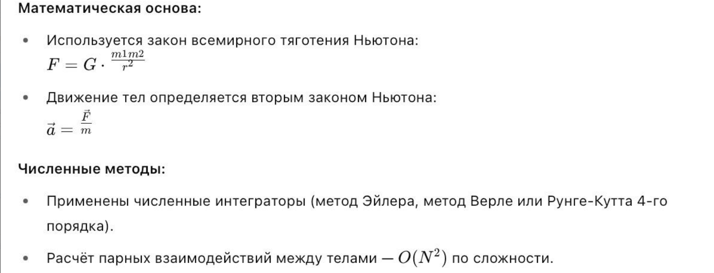
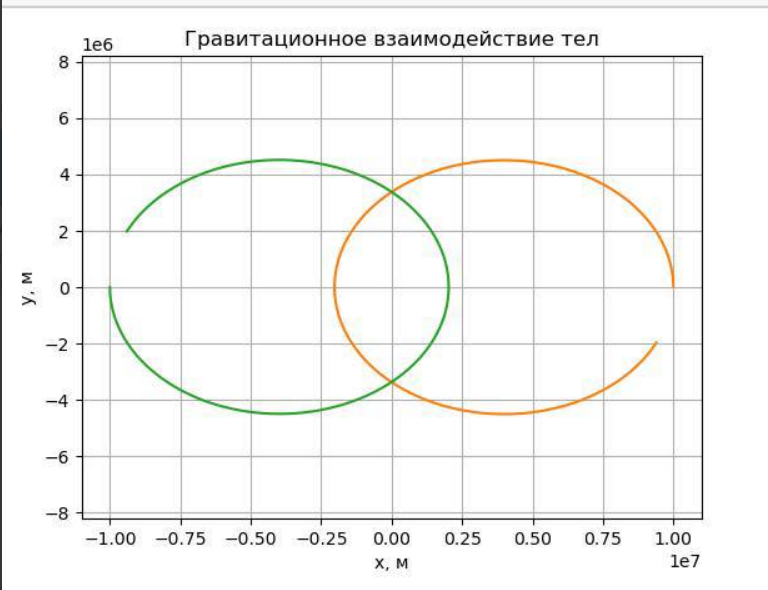
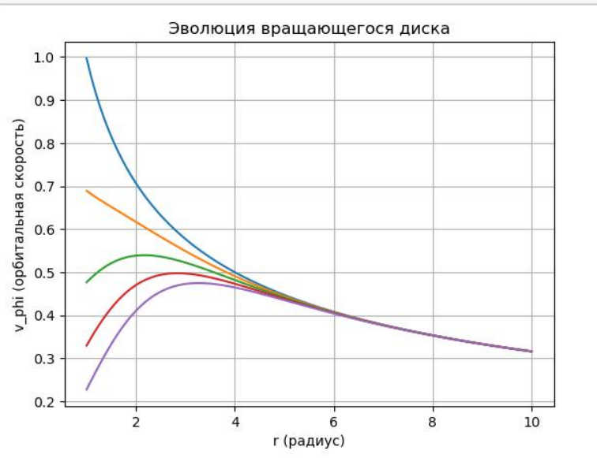
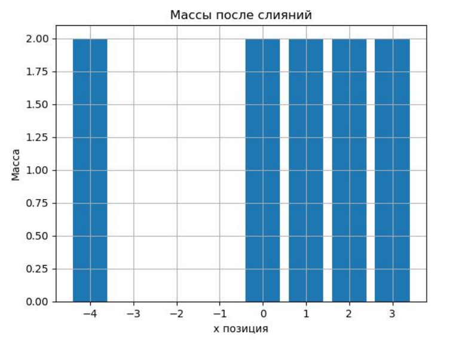

---
## Front matter
title: "Доклад на тему: Образование планетных систем"
subtitle: "Дисциплина: Математическое моделирование"
author: "Оширова Ю.Н., Пронякова О.М., Сидорова Н.А., Тимофеева Е.Н."

## Generic otions
lang: ru-RU
toc-title: "Содержание"

## Bibliography
bibliography: bib/cite.bib
csl: pandoc/csl/gost-r-7-0-5-2008-numeric.csl

## Pdf output format
toc: true # Table of contents
toc-depth: 2
lof: true # List of figures
lot: true # List of tables
fontsize: 12pt
linestretch: 1.5
papersize: a4
documentclass: scrreprt
## I18n polyglossia
polyglossia-lang:
  name: russian
  options:
	- spelling=modern
	- babelshorthands=true
polyglossia-otherlangs:
  name: english
## I18n babel
babel-lang: russian
babel-otherlangs: english
## Fonts
mainfont: IBM Plex Serif
romanfont: IBM Plex Serif
sansfont: IBM Plex Sans
monofont: IBM Plex Mono
mathfont: STIX Two Math
mainfontoptions: Ligatures=Common,Ligatures=TeX,Scale=0.94
romanfontoptions: Ligatures=Common,Ligatures=TeX,Scale=0.94
sansfontoptions: Ligatures=Common,Ligatures=TeX,Scale=MatchLowercase,Scale=0.94
monofontoptions: Scale=MatchLowercase,Scale=0.94,FakeStretch=0.9
mathfontoptions:
## Biblatex
biblatex: true
biblio-style: "gost-numeric"
biblatexoptions:
  - parentracker=true
  - backend=biber
  - hyperref=auto
  - language=auto
  - autolang=other*
  - citestyle=gost-numeric
## Pandoc-crossref LaTeX customization
figureTitle: "Рис."
tableTitle: "Таблица"
listingTitle: "Листинг"
lofTitle: "Список иллюстраций"
lotTitle: "Список таблиц"
lolTitle: "Листинги"
## Misc options
indent: true
header-includes:
  - \usepackage{indentfirst}
  - \usepackage{float} # keep figures where there are in the text
  - \floatplacement{figure}{H} # keep figures where there are in the text
---

## Этап 4. Защита проекта "Образование планетных систем"

### Введение

Формирование планетных систем — один из фундаментальных процессов, определяющих структуру Вселенной. Нас интересует вопрос: как из хаотичного облака газа и пыли возникает упорядоченная система с центральной звездой и вращающимися вокруг неё планетами?

В рамках нашего проекта мы стремились не только изучить теоретические аспекты этой задачи, но и реализовать численную модель, способную имитировать процессы, происходящие на ранних стадиях формирования планетных систем.

### Научная проблема

Процесс образования планет — это сложная система взаимодействий между газом, пылью и развивающимися телами в протопланетном диске. Основные механизмы, которые мы моделировали:

1. Гравитационное взаимодействие между телами (модель N-тел).
2. Гидродинамика газа в диске вокруг центрального объекта.
3. Слияние частиц при столкновениях с учётом физических критериев.

Каждый из этих процессов важен для формирования структуры системы, устойчивых орбит и образования протопланет.

### Модель и алгоритмы

В проекте была построена многокомпонентная численная модель, включающая три ключевых алгоритма. Каждый из них моделирует важный физический аспект формирования планетных систем.

#### 1. Алгоритм гравитационного N-тел

Цель: смоделировать гравитационное взаимодействие между множеством тел (частиц, планетезималей и т.д.).

{ #fig:pic1 width=100% }

Результат: тела начинают двигаться по орбитам вокруг общего центра масс. При правильной настройке можно наблюдать устойчивые орбитальные конфигурации, аналогичные системам звезда–планеты или двойным звёздам.

{ #fig:pic2 width=100% }

#### 2. Алгоритм гидродинамики вращающегося диска

Цель: смоделировать поведение газового протопланетного диска под действием внутренних сил, включая турбулентность и вязкость.

Подход:

* Диск разбит на кольца или ячейки, каждая из которых описывается своими параметрами: плотность, скорость, давление.
* Используется упрощённая версия уравнений Навье–Стокса в осесимметричном приближении.
* Основное внимание уделяется распределению скорости по радиусу и её изменению во времени.

Особенности:

* Турбулентность моделируется как потеря углового момента.
* Эволюция происходит с перераспределением массы: внутренняя часть диска теряет импульс быстрее, чем внешняя.

Результат: на графиках видно, как изменяется орбитальная скорость вещества со временем, особенно в центральной части — что характерно для реальных протопланетных дисков.

{ #fig:pic3 width=100% }

#### 3. Алгоритм слияния частиц

Цель: смоделировать процесс столкновений и слипания частиц, приводящий к образованию планетезималей.

Принцип работы:

* Частицы обладают положением, скоростью и массой.
* При сближении двух частиц на расстояние менее заданного порога проверяется их относительная скорость.
* Если скорость меньше критического значения (имитируя мягкое столкновение), частицы сливаются в одну:

  * Новая масса — сумма масс.
  * Новая скорость и позиция — средневзвешенные значения.

Физическая интерпретация:

* Модель учитывает, что при больших скоростях столкновение приведёт к разрушению, а не слиянию.
* Центральные частицы чаще сталкиваются, образуя более массивные тела.

Результат: визуально наблюдается формирование крупных тел в центре — аналог зарождения планет в области максимальной плотности диска.

{ #fig:pic4 width=100% }

### Программная реализация

Реализация модели выполнена на языке Python. Этот язык выбран за его простоту, большое сообщество и наличие библиотек для научных вычислений и визуализации.

Использованные технологии:

* NumPy — для высокопроизводительных операций с массивами и векториальными вычислениями.
* matplotlib — для построения графиков и анимации процессов.
* Собственные модули — реализующие каждый из трёх алгоритмов отдельно.

Реализованные функции:

1. Гравитационная симуляция:

   * Расчёт всех парных сил между телами.
   * Поддержка изменения параметров симуляции (количество тел, начальные скорости).
   * Визуализация орбит.

2. Гидродинамика:

   * Моделирование эволюции орбитальной скорости.
   * Отображение изменения диска во времени.
   * Гибкая настройка параметров вязкости и начального распределения.

3. Слияние частиц:

   * Простая визуализация столкновений.
   * График распределения масс после симуляции.
   * Подсчёт количества образовавшихся крупных тел.

Что особенно важно:

* Код написан модульно и может быть расширен.
* Простота кода позволяет другим исследователям или студентам легко адаптировать его под собственные задачи.
* Отдельные симуляции можно использовать для анимаций, что делает проект подходящим даже для образовательных целей.

### Обсуждение результатов

Мы добились следующих ключевых результатов:

* Построили и реализовали численную модель, охватывающую физику формирования планетных систем.
* Проверили корректность работы каждого алгоритма на тестовых примерах и визуально убедились в правдоподобии поведения модели.
* Получили первые качественные результаты: устойчивые орбиты, перераспределение вещества в диске и образование массивных тел в центральных областях.
* Подготовили код, который легко адаптируется и может быть использован для последующих исследований.

### Заключение и самооценка

Работа над проектом позволила нам объединить знания из физики, математики и программирования. Мы:

* Научились применять численные методы к реальным задачам.
* Освоили реализацию алгоритмов, работающих в динамике.
* Улучшили навыки визуализации и анализа результатов.
* Работали как команда, дополняя друг друга в теоретической и практической частях проекта.

Мы считаем проект успешным, так как он дал не только научное, но и практическое представление о том, как можно моделировать сложные астрофизические процессы с помощью современных вычислительных инструментов.
